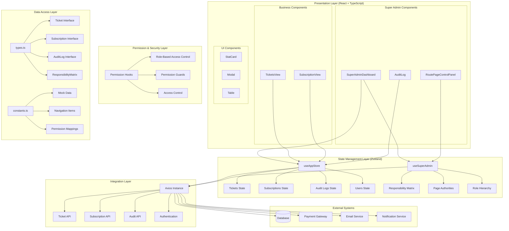

# Technical Specification: Comprehensive Admin System Integration

## Overview
This specification outlines the architecture for integrating Ticket Management Module and Subscription Module into the existing LuxeDining CRM super admin controls. The integration maintains type safety, follows existing patterns (Zustand state management, React hooks), and supports real API integration beyond current mocks.

## 1. Overall System Architecture

### Architecture Overview
The LuxeDining CRM admin system follows a layered architecture with clear separation of concerns:

1. **Presentation Layer**: React components with TypeScript for type safety
2. **State Management Layer**: Zustand stores for client-side state
3. **Permission Layer**: Hierarchical role-based access control
4. **Data Layer**: TypeScript interfaces and mock data (transitioning to API)
5. **Integration Layer**: Axios-based API client for backend communication

### Detailed Architecture Diagram


### Component Interactions and Data Flow

#### 1. Super Admin Dashboard Flow
```
User Login → Role Check → Permission Validation → Dashboard Render
    ↓
Stats Calculation → Table Data Fetch → Real-time Updates
    ↓
User Interactions → State Updates → API Calls → Audit Logging
```

#### 2. Route & Page Control Flow
```
Super Admin Selection → Admin List Display → Permission Matrix Load
    ↓
Page Authority Toggle → Matrix Update → Validation → Persistence
    ↓
Real-time Sync → Other Admin Sessions Update → Audit Log Entry
```

#### 3. Ticket Management Flow
```
Ticket Creation Form → Validation → State Update → API Call
    ↓
Status Changes → Permission Check → Update → Notification
    ↓
Audit Log → Email Alerts → Dashboard Refresh
```

#### 4. Subscription Management Flow
```
Plan Selection → Billing Calculation → Payment Processing
    ↓
Subscription Activation → State Update → API Persistence
    ↓
Auto-renewal Setup → Notification Schedule → Audit Logging
```

### Key Architectural Patterns

#### State Management Pattern
- **Zustand Stores**: Centralized state with actions and selectors
- **Optimistic Updates**: Immediate UI feedback with rollback on failure
- **Broadcast Channel**: Cross-tab synchronization for real-time updates

#### Permission Pattern
- **Hierarchical Roles**: Super Admin → Admin → Sub-Admin → Staff
- **Responsibility Matrix**: Feature and page-level permissions
- **Guard Components**: Conditional rendering based on permissions

#### Data Flow Pattern
- **Unidirectional Data Flow**: Actions → State → Components → Re-render
- **API Abstraction**: Axios instance with interceptors for auth/error handling
- **Mock to Real API**: Seamless transition with feature flags

#### Component Composition Pattern
- **Container/Presentational**: Business logic separated from UI
- **Higher-Order Components**: Permission and loading state wrappers
- **Compound Components**: Related UI elements grouped together

### Scalability Considerations
- **Lazy Loading**: Components loaded on demand
- **Virtual Scrolling**: For large lists (tickets, audit logs)
- **Pagination**: API-level pagination for performance
- **Caching**: Zustand persistence with TTL
- **Web Workers**: Heavy computations off main thread

### Security Architecture
- **Role-Based Access Control (RBAC)**: Permission checks at component level
- **API Authentication**: JWT tokens with refresh mechanism
- **Input Validation**: Client and server-side validation
- **Audit Trail**: All actions logged with immutable records
- **Data Encryption**: Sensitive data encrypted at rest and in transit

## 2. Integration Points

### SuperAdminDashboard Enhancements
- **New Stat Cards**: Total Tickets, Open Tickets, Active Subscriptions, Recent Changes
- **New Tables**:
  - Ticket Overview Table (ID, Subject, Status, Created Date, Assigned Admin)
  - Subscription Overview Table (Outlet, Plan, Status, Next Billing, Admin)
- **Integration**: Add ticket/subscription data to existing dashboard layout

### RoutePageControlPanel Integration
- **New Page Authorities**:
  - `TICKET_MANAGEMENT = 'Ticket Management'`
  - `SUBSCRIPTION_MANAGEMENT = 'Subscription Management'`
- **Permission Mapping**:
  - Super Admin: Full access to both
  - Admin: Can view/manage tickets, view subscriptions
  - Sub-Admin: Can view tickets, no subscription access

## 3. Permission Handling for Hierarchical Roles

### Permission Model Overview
The permission system follows a hierarchical role-based access control (RBAC) model with outlet-scoped permissions. Permissions are defined at three levels:

1. **Feature Authorities**: What actions a user can perform
2. **Page Authorities**: Which pages a user can access
3. **Navigation Control**: How pages are presented in navigation

### Detailed Role-Based Access Matrix

#### Feature-Level Permissions
| Feature Authority | Super Admin | Admin | Sub-Admin | Description |
|-------------------|-------------|-------|-----------|-------------|
| `MANAGE_TICKETS` | ✅ Full | ✅ Create/Update | ❌ View Only | Create, update, assign, and close tickets |
| `MANAGE_SUBSCRIPTIONS` | ✅ Full | ❌ View Only | ❌ None | Manage subscription plans and billing |
| `VIEW_AUDIT_LOGS` | ✅ Full | ❌ None | ❌ None | Access to audit logs and change history |
| `MANAGE_ADMINS` | ✅ Full | ❌ None | ❌ None | Create and manage admin accounts |
| `CONFIGURE_PERMISSIONS` | ✅ Full | ❌ None | ❌ None | Modify permission matrices |

#### Page-Level Permissions
| Page Authority | Super Admin | Admin | Sub-Admin | Access Level |
|----------------|-------------|-------|-----------|--------------|
| `TICKET_MANAGEMENT` | ✅ Full | ✅ Full | ✅ View | Dedicated ticket management interface |
| `SUBSCRIPTION_MANAGEMENT` | ✅ Full | ✅ View | ❌ None | Subscription plan and billing management |
| `ADMIN_MANAGEMENT` | ✅ Full | ❌ None | ❌ None | Admin account management |
| `AUDIT_LOG` | ✅ Full | ❌ None | ❌ None | Audit log viewing and filtering |
| `ROUTE_PAGE_CONTROL` | ✅ Full | ❌ None | ❌ None | Page access configuration |

#### Navigation Control Matrix
| Page | Super Admin | Admin | Sub-Admin |
|------|-------------|-------|-----------|
| Tickets | See | See | See |
| Subscription | See | See | Hide |
| Admin Management | See | Hide | Hide |
| Audit Log | See | Hide | Hide |
| Route Control | See | Hide | Hide |

### Permission Implementation Architecture

#### 1. Permission Hook Pattern
```typescript
// Custom hook for permission checking
export const usePermissions = () => {
  const { userRole, outletScope } = useAppStore();
  const { responsibilityMatrix } = useSuperAdmin();

  const hasFeatureAuthority = (feature: FeatureAuthority): boolean => {
    if (userRole === UserRole.SUPER_ADMIN) return true;
    return responsibilityMatrix?.featureAuthority[feature] ?? false;
  };

  const hasPageAuthority = (page: PageAuthority): boolean => {
    if (userRole === UserRole.SUPER_ADMIN) return true;
    return responsibilityMatrix?.pageAuthority[page] ?? false;
  };

  const getNavigationControl = (page: PageAuthority): NavigationControl => {
    if (userRole === UserRole.SUPER_ADMIN) return NavigationControl.SEE;
    return responsibilityMatrix?.navigationControl[page] ?? NavigationControl.HIDE;
  };

  return {
    hasFeatureAuthority,
    hasPageAuthority,
    getNavigationControl,
    canManageTickets: hasFeatureAuthority(FeatureAuthority.MANAGE_TICKETS),
    canManageSubscriptions: hasFeatureAuthority(FeatureAuthority.MANAGE_SUBSCRIPTIONS),
    canViewAuditLogs: hasFeatureAuthority(FeatureAuthority.VIEW_AUDIT_LOGS)
  };
};
```

#### 2. Permission Guard Components
```typescript
// Higher-order component for permission guarding
export const withPermission = <P extends object>(
  WrappedComponent: React.ComponentType<P>,
  requiredPermission: FeatureAuthority | PageAuthority,
  permissionType: 'feature' | 'page' = 'feature'
) => {
  return (props: P) => {
    const permissions = usePermissions();

    const hasPermission = permissionType === 'feature'
      ? permissions.hasFeatureAuthority(requiredPermission as FeatureAuthority)
      : permissions.hasPageAuthority(requiredPermission as PageAuthority);

    if (!hasPermission) {
      return (
        <div className="text-center p-8 text-neutral-500">
          <Shield className="mx-auto mb-4 h-12 w-12" />
          <h3 className="text-lg font-medium">Access Denied</h3>
          <p>You don't have permission to access this feature.</p>
        </div>
      );
    }

    return <WrappedComponent {...props} />;
  };
};
```

#### 3. Conditional Rendering Pattern
```typescript
// Component with conditional features based on permissions
export const TicketActions: React.FC<{ ticket: Ticket }> = ({ ticket }) => {
  const permissions = usePermissions();

  return (
    <div className="flex gap-2">
      {permissions.canManageTickets && (
        <Button onClick={() => updateTicket(ticket.id, { status: 'In Process' })}>
          Start Working
        </Button>
      )}

      {permissions.canManageTickets && ticket.status !== 'Closed' && (
        <Button onClick={() => closeTicket(ticket.id)}>
          Close Ticket
        </Button>
      )}

      {permissions.canViewAuditLogs && (
        <Button variant="outline" onClick={() => showAuditHistory(ticket.id)}>
          View History
        </Button>
      )}
    </div>
  );
};
```

### Outlet-Scoped Permissions

#### Multi-Outlet Permission Model
For organizations with multiple outlets, permissions can be scoped:

```typescript
interface OutletScopedPermissions {
  outletId: string;
  permissions: {
    featureAuthority: Record<FeatureAuthority, boolean>;
    pageAuthority: Record<PageAuthority, boolean>;
  };
}

interface AdminAccount {
  // ... existing fields
  outletScope: OutletScope; // 'Single Outlet' | 'Multi-Outlet'
  outletPermissions?: OutletScopedPermissions[];
}
```

#### Permission Resolution Logic
```typescript
const resolvePermissions = (
  userRole: UserRole,
  outletScope: OutletScope,
  outletPermissions: OutletScopedPermissions[],
  currentOutletId: string
): ResponsibilityMatrix => {
  // Super Admin has all permissions
  if (userRole === UserRole.SUPER_ADMIN) {
    return getFullPermissions();
  }

  // Single outlet admin
  if (outletScope === OutletScope.SINGLE) {
    return outletPermissions.find(p => p.outletId === currentOutletId)?.permissions
      ?? getDefaultPermissions(userRole);
  }

  // Multi-outlet admin - merge permissions across outlets
  const mergedPermissions = mergeOutletPermissions(outletPermissions);
  return mergedPermissions;
};
```

### Permission Change Workflow

#### 1. Permission Update Process
```
Super Admin → Select Admin → Modify Responsibility Matrix → Validate Changes → Save → Audit Log → Notify Admin
```

#### 2. Real-time Permission Sync
```
Permission Change → Broadcast to affected sessions → Update local state → Re-render components → Show/hide features
```

#### 3. Permission Validation
```typescript
const validatePermissionChange = (
  currentUser: User,
  targetAdmin: AdminAccount,
  newPermissions: Partial<ResponsibilityMatrix>
): ValidationResult => {
  // Super Admin can modify anyone
  if (currentUser.role === UserRole.SUPER_ADMIN) {
    return { valid: true };
  }

  // Admins cannot modify Super Admins
  if (targetAdmin.role === UserRole.SUPER_ADMIN) {
    return { valid: false, reason: 'Cannot modify Super Admin permissions' };
  }

  // Admins cannot grant permissions they don't have
  const unauthorizedGrants = Object.entries(newPermissions.featureAuthority || {})
    .filter(([feature, granted]) => granted && !hasFeatureAuthority(feature as FeatureAuthority))
    .map(([feature]) => feature);

  if (unauthorizedGrants.length > 0) {
    return {
      valid: false,
      reason: `Cannot grant permissions you don't have: ${unauthorizedGrants.join(', ')}`
    };
  }

  return { valid: true };
};
```

### Security Considerations

#### Permission Security Best Practices
- **Principle of Least Privilege**: Users get minimum permissions needed
- **Permission Inheritance**: Lower roles inherit restrictions from higher roles
- **Audit Trail**: All permission changes are logged
- **Session Invalidation**: Permission changes invalidate active sessions
- **Fail-Safe Defaults**: Deny access when permission check fails

#### Common Permission Patterns
- **Read-Only Access**: View permissions without modify permissions
- **Escalation Prevention**: Cannot grant permissions beyond your own
- **Time-Based Permissions**: Temporary elevated access with expiration
- **Context-Aware Permissions**: Permissions based on data ownership (outlet-specific)

### Testing Permission Logic
```typescript
describe('Permission System', () => {
  test('Super Admin has all permissions', () => {
    const permissions = usePermissions(UserRole.SUPER_ADMIN);
    expect(permissions.canManageTickets).toBe(true);
    expect(permissions.canManageSubscriptions).toBe(true);
  });

  test('Admin cannot manage subscriptions', () => {
    const permissions = usePermissions(UserRole.ADMIN);
    expect(permissions.canManageTickets).toBe(true);
    expect(permissions.canManageSubscriptions).toBe(false);
  });

  test('Sub-Admin has limited ticket access', () => {
    const permissions = usePermissions(UserRole.SUB_ADMIN);
    expect(permissions.canManageTickets).toBe(false);
    expect(permissions.canViewTickets).toBe(true);
  });
});
```

## 4. Data Structures

### New Types in types.ts
```typescript
// Enhanced Ticket interface
export interface Ticket {
  id: string;
  subject: string;
  category: 'Technical' | 'Billing' | 'Feature Request' | 'Other';
  description: string;
  status: 'Pending' | 'In Process' | 'Resolved' | 'Closed';
  createdAt: Date;
  updatedAt: Date;
  assignedTo?: string; // Admin ID
  priority: 'Low' | 'Medium' | 'High' | 'Critical';
  outletId?: string; // For multi-outlet support
}

// Enhanced Subscription Plan
export interface SubscriptionPlan {
  id: string;
  name: string;
  price: number;
  validity: string;
  features: string[];
  maxOutlets?: number;
  isActive: boolean;
}

// Subscription instance for outlets
export interface OutletSubscription {
  id: string;
  outletId: string;
  planId: string;
  startDate: Date;
  endDate: Date;
  status: 'Active' | 'Expired' | 'Cancelled';
  autoRenew: boolean;
  paymentMethod?: string;
}

// Enhanced Audit Log
export interface AuditLogEntry {
  id: string;
  adminId: string;
  action: string;
  details: string;
  timestamp: Date;
  performedBy: string;
  entityType: 'ticket' | 'subscription' | 'admin' | 'permission';
  entityId: string;
  outletId?: string;
}

// New Page Authorities
export enum PageAuthority {
  // ... existing
  TICKET_MANAGEMENT = 'Ticket Management',
  SUBSCRIPTION_MANAGEMENT = 'Subscription Management'
}

// New Feature Authorities
export enum FeatureAuthority {
  // ... existing
  MANAGE_TICKETS = 'Can manage tickets',
  MANAGE_SUBSCRIPTIONS = 'Can manage subscriptions',
  VIEW_AUDIT_LOGS = 'Can view audit logs'
}
```

## 5. Constants Updates

### New Mock Data in constants.ts
```typescript
export const MOCK_TICKETS: Ticket[] = [
  {
    id: 'tk1',
    subject: 'Printer Connection Issue',
    category: 'Technical',
    description: 'Kitchen printer disconnects intermittently.',
    status: 'Pending',
    createdAt: new Date(),
    updatedAt: new Date(),
    priority: 'High',
    assignedTo: 'u1'
  },
  // ... more tickets
];

export const MOCK_OUTLET_SUBSCRIPTIONS: OutletSubscription[] = [
  {
    id: 'os1',
    outletId: 'outlet1',
    planId: 'sp2',
    startDate: new Date(),
    endDate: new Date(Date.now() + 365 * 24 * 60 * 60 * 1000),
    status: 'Active',
    autoRenew: true
  }
];

// Updated NAV_ITEMS with new permissions
export const NAV_ITEMS = {
  [UserRole.SUPER_ADMIN]: [
    // ... existing
    'Ticket Management',
    'Subscription Management'
  ],
  [UserRole.ADMIN]: [
    // ... existing
    'Tickets', // existing view
    'Subscription' // existing view
  ],
  // ... other roles
};
```

## 6. Audit Logging Integration

### Audit Events for Tickets
- `TICKET_CREATED`: When a new ticket is created
- `TICKET_UPDATED`: When ticket status/assignment changes
- `TICKET_CLOSED`: When a ticket is resolved/closed

### Audit Events for Subscriptions
- `SUBSCRIPTION_ACTIVATED`: When a new subscription is activated
- `SUBSCRIPTION_UPDATED`: When plan or settings change
- `SUBSCRIPTION_CANCELLED`: When subscription is cancelled
- `PAYMENT_PROCESSED`: When subscription payment is processed

### Implementation
- Extend `AuditLogEntry` with `entityType` and `entityId`
- Add audit logging calls in ticket/subscription CRUD operations
- Display audit logs in SuperAdminDashboard and dedicated AuditLog view

## 7. Scalability Considerations for Multi-Outlet Setups

### Database Design
- **Ticket Table**: Include `outletId` for outlet-specific tickets
- **Subscription Table**: Separate outlet subscriptions from global plans
- **Audit Logs**: Include `outletId` for outlet-specific actions

### Permission Model
- **Outlet Scope**: Admins can be scoped to single or multi-outlet
- **Hierarchical Permissions**: Super Admin sees all outlets, Admins see assigned outlets
- **Data Filtering**: All queries filter by outlet permissions

### Performance Optimizations
- **Pagination**: Implement pagination for large ticket/subscription lists
- **Caching**: Cache subscription plans and permission matrices
- **Real-time Updates**: Use WebSockets for live ticket status updates

### API Design
- **RESTful Endpoints**: `/api/outlets/{outletId}/tickets`, `/api/subscriptions`
- **Filtering**: Support outlet-based filtering in all endpoints
- **Rate Limiting**: Implement rate limits for ticket creation

## 8. Implementation Plan

### Phase 1: Backend API Design (Week 1-2)
- Design RESTful APIs for tickets and subscriptions
- Implement authentication and authorization middleware
- Create database schemas with outlet support
- Set up audit logging infrastructure

### Phase 2: Frontend Core Integration (Week 3-4)
- Update types.ts with new interfaces
- Enhance Zustand store with ticket/subscription state
- Implement permission hooks and guards
- Create enhanced TicketView and SubscriptionView components

### Phase 3: Super Admin Controls (Week 5-6)
- Update SuperAdminDashboard with new stats and tables
- Integrate RoutePageControlPanel with new page authorities
- Implement audit log viewing and filtering
- Add bulk operations for ticket management

### Phase 4: Testing and Optimization (Week 7-8)
- Unit tests for all new components
- Integration tests for permission system
- Performance testing for multi-outlet scenarios
- Security audit and penetration testing

### Phase 5: Deployment and Monitoring (Week 9-10)
- Gradual rollout with feature flags
- Monitor performance and error rates
- User acceptance testing
- Documentation and training materials

## 9. Migration Strategy
- **Data Migration**: Migrate existing mock data to new schema
- **Permission Migration**: Update existing admin permissions
- **Backward Compatibility**: Maintain existing API contracts
- **Rollback Plan**: Feature flags for easy rollback

## 10. Success Metrics
- **Performance**: Dashboard load time < 2 seconds
- **User Experience**: Ticket resolution time reduced by 30%
- **Security**: Zero permission bypass incidents
- **Scalability**: Support for 100+ outlets without performance degradation

This specification provides a comprehensive blueprint for integrating ticket and subscription management into the LuxeDining CRM admin system while maintaining scalability, security, and user experience standards.